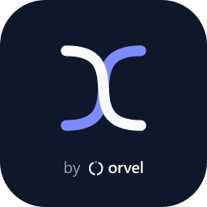

<p align="center">
  
</p>

<h1 align="center">Factur-X MCP server</h1>

<p align="center">
  Generate, validate and read <b>Factur-X / EN 16931</b> e-invoices (France, EU) from any MCP client.<br>
  Remote server, no install. PDF/A-3 · CII · UBL 2.1 · French <code>fr-ctc</code> rules.
</p>

<p align="center">
  <a href="https://facturx.orvel.dev/docs/">Docs</a> ·
  <a href="https://facturx.orvel.dev/docs/mcp/">MCP guide</a> ·
  <a href="https://facturx.orvel.dev/docs/pricing/">Pricing (free key, no card)</a> ·
  <a href="https://facturx.orvel.dev/docs/conformity/">Conformity report</a> ·
  <a href="https://leborgneantoine.github.io/orvel-status/">Status</a>
</p>

---

**Endpoint:** `https://facturx.orvel.dev/mcp` (Streamable HTTP, stateless)
**Registry:** [`io.github.LeBorgneAntoine/facturx`](https://registry.modelcontextprotocol.io/v0/servers?search=facturx) on the official MCP registry

France makes electronic invoicing mandatory for all VAT-registered businesses (receiving from September 2026, issuing 2026–2027). Factur-X is the hybrid PDF + XML format of that reform. This server lets an AI agent in Claude, Cursor, VS Code, ChatGPT or your own app produce, check and read compliant invoices without writing an integration.

## Tools

| Tool | What it does |
| --- | --- |
| `generate_invoice` | Invoice JSON → Factur-X PDF/A-3, CII XML or UBL XML. Profiles MINIMUM → EXTENDED, EN 16931, FR/EN rendering |
| `embed_xml` | Attach a Factur-X XML to your own PDF and produce a valid PDF/A-3 |
| `validate_invoice` | XSD + EN 16931 schematron (+ French `fr-ctc`), structured findings with rule ids |
| `extract_invoice` | Read a PDF or XML e-invoice: parties, totals, VAT breakdown, lines |

Resources: `facturx://schema/invoice` (JSON Schema of the invoice object) and `facturx://guide/french-reform`.

All tools are `readOnlyHint` / `idempotentHint`. Nothing is stored server-side. `initialize`, `tools/list` and `resources/*` work without a key so you can inspect the server before choosing a plan.

## Connect

Get a key at [facturx.orvel.dev/docs/pricing](https://facturx.orvel.dev/docs/pricing/) (Free plan: 50 documents/month, no card) and send it as `Authorization: Bearer <key>`.

**Cursor** (`.cursor/mcp.json`)

```json
{
  "mcpServers": {
    "facturx": {
      "url": "https://facturx.orvel.dev/mcp",
      "headers": { "Authorization": "Bearer YOUR_KEY" }
    }
  }
}
```

**VS Code** (`.vscode/mcp.json`)

```json
{
  "servers": {
    "facturx": {
      "type": "http",
      "url": "https://facturx.orvel.dev/mcp",
      "headers": { "Authorization": "Bearer YOUR_KEY" }
    }
  }
}
```

**Claude Code**

```bash
claude mcp add --transport http facturx https://facturx.orvel.dev/mcp --header "Authorization: Bearer YOUR_KEY"
```

**Claude Desktop** (custom connectors cannot send headers yet, so bridge with `mcp-remote`)

```json
{
  "mcpServers": {
    "facturx": {
      "command": "npx",
      "args": ["-y", "mcp-remote", "https://facturx.orvel.dev/mcp", "--header", "Authorization: Bearer ${FACTURX_KEY}"],
      "env": { "FACTURX_KEY": "YOUR_KEY" }
    }
  }
}
```

More clients (Python SDK, AgenticMarket pay-per-call) in the [MCP guide](https://facturx.orvel.dev/docs/mcp/).

## Example prompts

- "Generate a Factur-X invoice for this quote: seller Atelier Numérique SAS (SIREN 732829320, VAT FR40732829320, Paris), buyer Boulangerie Dupont (SIREN 552081317, Lyon), 1 × website development 2500 EUR HT at 20 %, 12 months hosting at 15 EUR, due in 30 days."
- "Validate the attached supplier invoice against the French rules and explain each failing rule in plain words."
- "Extract the totals and VAT breakdown from these three PDFs and give me a table."

## Conformity

Every published sample is validated by an independent engine (Mustangproject, the reference open-source Factur-X validator): XSD, EN 16931 schematron, French CTC rules, PDF/A-3 with the embedded `factur-x.xml`. Reports and reproduction steps: [Conformity](https://facturx.orvel.dev/docs/conformity/).

## REST API

The same engine is available as a REST API (`/v1/invoices/generate`, `/v1/validate`, `/v1/extract`, OpenAPI at `/openapi.json`). One key, both interfaces, one quota. See the [API reference](https://facturx.orvel.dev/docs/api/).

## About

Built and operated by [Orvel](https://facturx.orvel.dev/docs/) (Antoine Le Borgne, France). Hosted in the EU (Railway, Amsterdam). Support: <support@orvel.dev>.

This repository holds the public manifest (`server.json`), brand assets and client examples of the hosted server. The engine itself is closed source.
